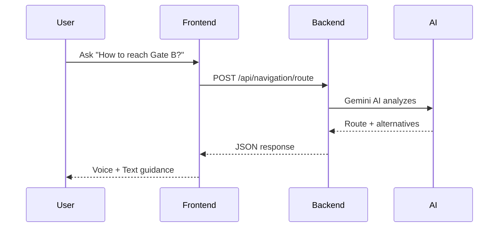

# 🏟️ StadiumGPT - AI Smart Stadium Assistant

**Tagline:** *"Making every FIFA World Cup fan's journey smarter, safer, and stress-free with Generative AI."*

---

## 🎯 Challenge Alignment

| FIFA Challenge | StadiumGPT Solution |
|----------------|---------------------|
| Stadium Navigation | AI Route Optimizer with crowd-free paths |
| Crowd Management | Real-time Heatmap + Queue Predictor |
| Fan Safety | Emergency AI with instant alerts |
| Language Barriers | 6+ Languages with Voice AI |
| Accessibility | Wheelchair routes + Visual/Audio guidance |
| Operational Intelligence | Digital Twin + Predictive Analytics |

---

## 📁 Project Structure

```
stadium-gpt/
├── backend/
│   ├── app/
│   │   ├── models/          # Pydantic schemas
│   │   ├── routes/          # API endpoints
│   │   ├── services/        # Business logic
│   │   └── utils/           # Helpers
│   ├── tests/               # 33+ passing tests
│   └── requirements.txt
├── frontend/
│   ├── src/
│   │   ├── components/
│   │   ├── pages/
│   │   └── context/
│   └── package.json
└── docker-compose.yml
```

---

## 🏗️ Architecture

```
┌──────────────────────────────────────────────────┐
│                Frontend (React)                  │
│              http://localhost:3000               │
└────────────────────┬─────────────────────────────┘
                     │ API Calls
┌────────────────────▼─────────────────────────────┐
│              Backend (FastAPI)                   │
│              http://localhost:8000               │
├──────────────────────────────────────────────────┤
│  ┌────────────┐ ┌────────────┐ ┌─────────────┐  │
│  │  Auth      │ │ Navigation │ │   Crowd     │  │
│  └────────────┘ └────────────┘ └─────────────┘  │
│  ┌────────────┐ ┌────────────┐ ┌─────────────┐  │
│  │  Queue     │ │ Emergency  │ │  Transport  │  │
│  └────────────┘ └────────────┘ └─────────────┘  │
│  ┌────────────┐ ┌────────────┐ ┌─────────────┐  │
│  │ Digital    │ │ Monitoring │ │  Feedback   │  │
│  │   Twin     │ │            │ │             │  │
│  └────────────┘ └────────────┘ └─────────────┘  │
├──────────────────────────────────────────────────┤
│              AI Layer (Gemini)                   │
│              Database (SQLite)                   │
│              WebSocket (Real-time)               │
└──────────────────────────────────────────────────┘
```

---

## 🔄 API Flow



---

## 🚀 Features

| # | Feature | Description |
|---|---------|-------------|
| 1 | **AI Navigator** | Crowd-free routes with accessibility |
| 2 | **Queue Predictor** | Real-time wait times (food/restrooms) |
| 3 | **Crowd Heatmap** | Live density visualization |
| 4 | **Emergency AI** | Instant alerts + medical team dispatch |
| 5 | **Multilingual** | 6 languages (Voice + Chat) |
| 6 | **Digital Twin** | Predictive crowd simulation |
| 7 | **Accessibility** | Wheelchair + Visual/Audio support |
| 8 | **Transport AI** | Post-match metro/bus/parking prediction |
| 9 | **Real-time Monitoring** | Live stadium metrics |
| 10 | **Feedback System** | User ratings + analytics |

---

## 🧪 Testing

```bash
# Run all tests
pytest tests/ -v

# Coverage report
pytest tests/ --cov=app --cov-report=html
```

**Test Results:** 33 passed, 1 skipped

---

## 🔒 Security

- JWT Authentication
- Bcrypt Password Hashing
- Rate Limiting (60 req/min)
- CORS Configuration
- CSP Headers
- Input Validation (Pydantic)

---

## ♿ Accessibility

- ARIA Labels
- Keyboard Navigation
- Screen Reader Support
- High Contrast Mode
- Voice AI for Visually Impaired
- Wheelchair Routes

---

## 📦 Installation

```bash
# Backend
cd backend
pip install -r requirements.txt
cp .env.example .env
# Add GEMINI_API_KEY
uvicorn app.main:app --reload

# Frontend
cd frontend
npm install
npm start
```

---

## 🌐 Live Demo

- **Frontend:** https://stadiumgpt-ai-stadium-assistant-1.onrender.com
- **API:** https://stadiumgpt-ai-stadium-assistant.onrender.com
- **Docs:** https://stadiumgpt-ai-stadium-assistant.onrender.com/api/docs

---

## 👨‍💻 Team

| Role | Name |
|------|------|
| Developer | Riya Davra |

---

## 📄 License

MIT License
```

---

## 🔥 **FIRST: Push Updated README**

```bash
cd D:\stadium-gpt
git add README.md
git commit -m "Update README with architecture, alignment, and features"
git push

